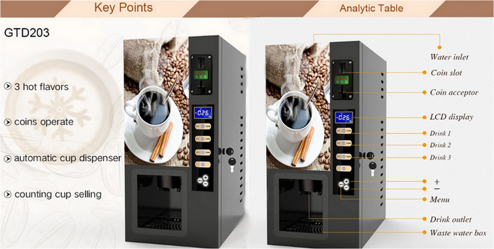

<h2  align="center">Coffee Machine</h2>

<p  align="center"></p>

[EN](https://github.com/rafael-s-santos/coffee_machine) | PT

<p  align="center">Colocando em Prática Aprendizados de Programação Orientada a Objeto</p>

Este é um programa Python para uma máquina de café que permite aos usuários selecionar e comprar diversas bebidas de café. O programa possui as seguintes features:

## Requisitos

1.  ### Pergunta ao usuário "What would you like? (expresso/latte/cappuccino):"
    -   Verifique a entrada do usuário para decidir o que fazer a seguir.
    -   O aviso deve aparecer sempre que uma ação for concluída, por exemplo, quando a bebida for distribuída. O prompt deve aparecer novamente para atender o próximo cliente.

2.  ### Desligue a máquina de café digitando “off” no prompt.
    -   Os mantenedores da máquina de café podem usar “off” como palavra secreta para desligar a máquina. Seu código deverá encerrar a execução quando isso acontecer.

3.  ### Relatório de impressão.
    -   Quando o usuário insere "report" no prompt, um relatório deve ser gerado mostrando os valores atuais do recurso. por exemplo
        ```
        Water: 100ml
        Milk: 50ml
        Coffee: 76g
        Money: $2.5
        ``` 
        
4.  ### Verifique se os recursos são suficientes?
    
    -   Quando o usuário escolhe uma bebida, o programa deverá verificar se há recursos suficientes para fazer aquela bebida.
    -   Por exemplo, se o Latte precisar de 200ml de água, mas restar apenas 100ml na máquina, ela não deverá continuar a preparar a bebida, mas imprimir: "Desculpe, não há água suficiente."
    -   O mesmo deverá acontecer se outro recurso se esgotar, por exemplo, leite ou café.
 
5.  ### Processar moedas.
    
    -   Se houver recursos suficientes para selecionar a bebida, o programa deverá solicitar ao usuário a inserção de moedas.
    -   Lembre-se de que quarters = $0.25, dimes = $0.10, nickels = $0.05 e pennies = $0.01.
    -   Calcule o valor monetário das moedas inseridas. Por exemplo, 1 quarter, 2 nickels, 1 nickel, 2 pennies = $ 0,52
6.  ### Verifique se a transação foi bem-sucedida?
    
    -   Verifique se o usuário inseriu dinheiro suficiente para comprar a bebida selecionada. Por exemplo, o latte custa $ 2,50, mas eles inseriram apenas $ 0,52 e, depois de contar as moedas, o programa deveria dizer "Sorry, not enough money. Money refunded." ("Desculpe, não há dinheiro suficiente. Dinheiro devolvido.").
    -   Mas se o usuário tiver inserido dinheiro suficiente, o custo da bebida será adicionado à máquina como lucro e isso será refletido na próxima vez que o "report" for acionado. Por exemplo:
          
        ```
        Water: 100ml
        Milk: 50ml
        Coffee: 76g
        Money: $2.5
        ``` 
        
    -   Caso o usuário tenha inserido muito dinheiro, a máquina deverá oferecer troco. Por exemplo, "Here is $2.45 in change." ("Aqui estão $ 2,45 dólares em troco."). A variação deverá ser arredondada para 2 casas decimais.
7.  ### Fazer café.
    
    -   Se a transação for bem-sucedida e houver recursos suficientes para preparar a bebida selecionada pelo usuário, os ingredientes para fazer a bebida deverão ser deduzidos dos recursos da máquina de café.
    -   Por exemplo, informe antes de comprar latte:
        
        ```
        Water: 300ml
        Milk: 200ml
        Coffee: 100g
        Money: $0
        ``` 
        
    -   Relatório após comprar latte:
        
        ```
        Water: 100ml
        Milk: 50ml
        Coffee: 76g
        Money: $2.5`
        ``` 
        
    -   Depois que todos os recursos forem deduzidos, diga ao usuário "Here is your latte. Enjoy!" ("Aqui está o seu latte. Aproveite!") se latte fosse sua escolha de bebida.

## Começando
Para executar o Programa Coffee Machine, siga estes passos:

1.  Certifique-se de ter o Python instalado em seu computador.
2.  Clone este repositório em sua máquina local.
3.  Abra seu terminal ou prompt de comando e navegue até o diretório onde você clonou o repositório.
4.  Execute o `coffee_machine.py`script executando o seguinte comando:
    `python coffee_machine.py` 
5.  Siga as instruções na tela para interagir com a máquina de café.
    
Aproveite seu café! ☕